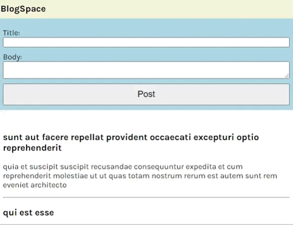
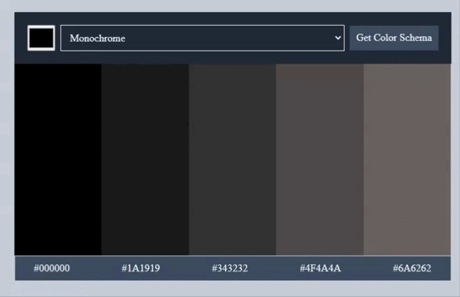

## Table of contents

- [Overview](#overview)

- [Projects](#projects)

  - [1-BoredBot App](#bored-bot)
  - [2-BlogSpace App](#blog-space)
  - [3-Color Schema Genarator](#color-generator)
    
    
  ## Overview

  Completed these projects that are parts of [Scrimba](https://scrimba.com/learn/frontend/)'s Working with APIs. I mastered HTML/CSS, APIs in these projects.
  You can see the visual representations of the each app below.

  ## Projects

  ### 1-BoredBot App

  ### Visualization of the app;
  
  
  
  
  ### Description
  
  I created a BoredBot app using an API called as https://apis.scrimba.com/bored/api/activity?type=education. When user clicks the button, text is rendered to DOM. You can get more information how to user Bored API on [this website](https://apis.scrimba.com/bored/documentation).
  
  
  ### What I Learned?
  - Server & Clients
  - Request/Response Cycle
  - APIs & async Javascript
  - JSON
  - fetch() syntax
  - Bored API
    
    
  ### 2-BlogSpace App
  
  ### Visualization of the app;
  
  
  
  
  ### Description
  
  I created a BlogSpace app using an API called as https://apis.scrimba.com/jsonplaceholder/posts. When user clicks the button;
    - First 5 posts are listed
    - User can send a post typing title and body content

  ### What I Learned?
  - HTTP Requests
    - URLs, endpoints, methods, Body, Headers
  - REST APIs
    - Resources
    - Parameters
    - Queries
    
    
  ### 3-Solo Project: Color Schema Generator
  ### ✨ [Live Link](https://scrimba-color-generator.netlify.app/)
  
  ### Visualization of the app;
  
  
  
  ### Description
  
  I created a solo project called as Color Schema Generator. The app uses an API on https://www.thecolorapi.com/docs#schemes-generate-scheme-get. The app features;
    - User can select a seed color with a color picker or
    - Select a color on dropdown list
    - Schema colors and hex values are displayed on the page
