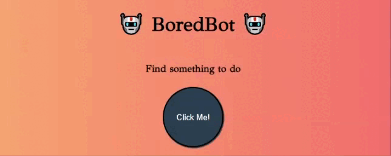

## Table of contents

- [Overview](#overview)

- [Projects](#projects)

  - [1-BoredBot App](#bored-bot)
  ## Overview

  Completed these projects that are parts of [Scrimba](https://scrimba.com/learn/frontend/)'s Working with APIs. I mastered HTML/CSS, APIs in these projects.
  You can see the visual representations of the each app below.

  ## Projects

  
  ### 1-BoredBot App
  
  
  ### Visualitaziton of the app;
  
  
  
  
  ### Description
  
  I created a BoredBot app using an API called as https://apis.scrimba.com/bored/api/activity. When user clicks activity text is rendered to DOM.

  ### What I Learned?
  

  - Server & Clients
  - Request/Response Cycle
  - APIs
  - JSON
  - fetch() syntax
